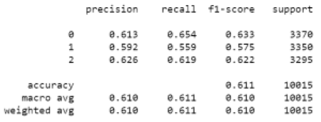

# Determining Song Success | Classification Modeling
by: Dana Rausch

## Business Problem

Stakeholders at record labels are becoming overwhelmed with the amount of music sent in for their evaluation. As music creation becomes more accessible, the industry has become inundated with new music. Record labels receive too many songs to listen to and properly evaluate, many of which will not be successful. In order to streamline this process and improve ROI for these stakeholders, record labels must find a way to spend valuable time considering only songs that have potential for success.

### Hypothesis 

Null hypothesis: Technical features of a song have no relationship with its success.
Alternative hypothesis: Technical features do have a relationship with song success and can inform and predict outcomes of new songs.

## Methods and Data

### Data Methodology

It was important to use an iterative approach to modeling and analysis for this project. Because most of the features of this dataset are continuous, logistic regression seemed like the obvious choice for initial modeling. Sensitivity was prioritized during this project as the risk of missing out a successful song is greater than the risk of spending time considering a song that may not be the next big hit. After mediocre performance with the first model, synthetic minority sampling, normalization, and standardization were applied to the data along with a multi-class OneVsAll method to the classification model itself. 
Multiple additional considerations were taken as this data is multi-class and slightly imbalanced. Train/ test splits were stratified and class labels were binarized to enable the use of binary modeling techniques. 

### Data

Kaggle: [This dataset](https://www.kaggle.com/yamaerenay/spotify-dataset-19212020-160k-tracks?select=data_w_genres.csv) originally from the Spotify API and sourced from Kaggle was used for this project. 
The original dataset measured popularity on a scale of 1-100, which were grouped into three classes - unsuccessful, successful, and very successful - based on popularity quartiles for this project. The results displayed below are the result of standardization as well as normalization of the original data.   

## Findings 

Of all the songs released, only a small percentage are considered very successful. In fact, as seen below, most songs are unsuccessful. This reinforces the importance of the stakeholder's need for a better process to focus on songs that are likely to be successful.

  

Determining why a person likes or dislikes a song is completely subjective and difficult to measure, which is why it seemed important to ascertain which features were most important, or most influential, for a song's success. After using logistic regression to model this data, analyzing the coeffcient scores for each feature gave a clear view of each feature's importance. 
The three most important features to a song's success are as follows: 
1. Acousticness: 0.98
2. Instrumentalness: 0.79
3. Loudness: 0.42

After receiving mediocre results from the original model, it was necessary to gain a better understanding of the distribution of success and its relationship to these top features. During initial analysis and modeling, it was becoming clear that a precise model may not be possible.

From the below, it's obvious that there's little differentiation between successful and unsuccessful songs, even when looking at the relationship to the most influential features.

Using Logistic regression with a One Vs All approach, Unsuccessful songs showed a high TPR while the other two classes performed worse than basic guessing. Although recall for the Unsuccessful class is 87%, many Successful and Very Successful songs were incorrectly classed as Unsuccessul. Only 37% of Successful songs and 44% of Very Successful songs were correctly classed by this model. This is the opposite of what we want as the risk of missing out on a Very Successful song is greater and could be more detrimental than spending time evaluating a potenially Unsuccessful song. 

True Positive Rates:
1. Unsuccessful: 87%
2. Successful: 37%
3. Very Successful: 44% 

Using SMOTE (Synthetic Minority Oversampling TEchnique) to create an artifically balanced dataset, the TPR was much more balanced across all classes. All classes had a TPR of around 56 - 65% after applying SMOTE. Although the Unsuccessful class has a lower recall score with this model iteration, an increase of 19% (Successful) and 18% (Very Successful) in the other two classes makes this a more successful model for the stakeholders overall as more songs with the potential for success are being captured. 

   

## Recommendations 

As this model cannot predict all classes with high accuracy, it would be best to consider all songs marked as 'very successful' as well as 'successful' worthy of evaluation. This also means that all songs classed as 'unsuccessful' can be ignored as their chance for success is quite low. For feature-based suggestions on what makes a song successful, a genre-based model is recommended as a model with a clearer point of view and narrower field will yield more successful results. 

## Conclusion and Future Work

This model is reliable for directional predicted success vs. unsuccess of a song. All songs classed as either 'very successful' or 'successful' should be considered for evaluation while songs classed as 'unsuccessful' are generally not worth the time of an evaluation. Using this model, record labels can streamline their process and focus on songs with greater potential, resulting in a higher and quicker return on investment.

Going forward, decision thresholds can be re-evaluated to possibly create a more reliable model. To be even more successful, this model could be adjusted to a binary classification of only Successul/ Unsuccessful. Models with a narrower field, genre for example, could then be used for more distinct insights such as features that contribute to a song's success. 

## More Information

Please feel free to review the code behind this project in the Jupyter Notebooks and view the non-technical presentation. 

Kindly reach out with any questions and connect with me on [LinkedIn](https://www.linkedin.com/in/dana-rausch-b73538a6/)